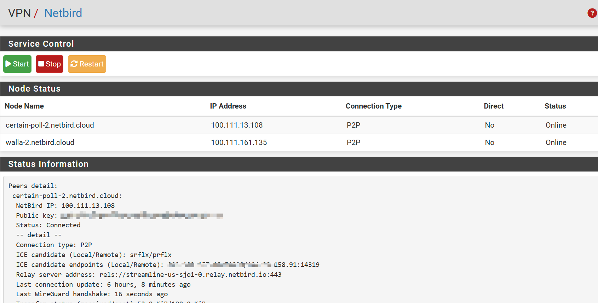

# NetBird for pfSense

这是一个可以在 pfSense 上使用 NetBird 的控制程序。Web 控制代码借助 ChatGPT 编写，可以实现简单的控制和查看节点功能。NetBird 程序的编译版本为 0.36.3


## 前提条件

在安装之前，请先注册 NetBird 帐号，并进入控制台页面。

确保在防火墙的 WAN 接口上放行 WireGuard 的默认通信端口。

## 安装方法

1. 下载附件并解压缩，上传到防火墙的根目录。
2. 进入文件目录并运行以下命令启动安装程序：

    ```bash
    sh install.sh
    ```
	
安装过程如下所示：
    ```bash
Installing Netbird...
Installing netbird-0.31.0...
pkg: wrong architecture: FreeBSD:14:amd64 instead of FreeBSD:15:amd64
package netbird is already installed, forced install
Extracting netbird-0.31.0: 100%
=====
Message from netbird-0.31.0:

--
At this time this code is new, unvetted, possibly buggy, and should be
considered "experimental". It might contain security issues. We gladly
welcome your testing and bug reports, but do keep in mind that this code
is new, so some caution should be exercised at the moment for using it
in mission critical environments.

Copying files...
Generating menu...
Configuring system service...
netbird_enable: YES -> YES

Adding execute permissions...
Registering node...
Follow the instructions and enter the authentication link in your browser, click confirm, and complete the authentication.
Stopping netbird.
Waiting for PIDS: 14120.
Deleting old configuration file
netbird 11345 - - Starting netbird.
Please do the SSO login in your browser. 
If your browser didn't open automatically, use this URL to log in:

https://login.netbird.io/activate?user_code=PGMX-CJCT 


Alternatively, you may want to use a setup key, see:

https://docs.netbird.io/how-to/register-machines-using-setup-keys
Connected
Adding startup command:
Add [service netbird start] in the shellcmd plugin.

Installation completed...

Navigate to VPN > NetBird to check the connection status.
To allow node communication, you also need to add the wt0 virtual network interface as an interface, enter the IP address assigned to the node, and add firewall rules on the interface.

    ```	

3. 根据提示，在浏览器输入认证地址进行认证激活：
   
    - 浏览器会显示确认页面，点击确认后认证通过。
    - 在 NetBird 的 Web 控制台中，您将看到刚才认证的设备节点，点击右侧的选项，单击“禁用会话过期”，这样就可以一直保持节点在线。

4. 导航到 `VPN > NetBird` 菜单，您可以查看 NetBird 的节点信息，并对程序运行进行控制。


## 添加路由

为了保证各个 NetBird 节点之间的互访，需要在 NetBird 控制台添加一条 **All 到 All** 的通行策略。

1. 进入控制台，点击左侧功能导航栏，选择 `Polices`，然后点击“添加策略”。
2. 单击“添加”按钮，源和目标都选择 **All**，选中启用策略，然后单击“继续”。
3. 访问控制策略，非商业用户不包含该功能，单击“继续”。
4. 给策略输入一个名称和简单的描述信息，然后单击“添加策略”按钮。

## 添加防火墙规则

在添加防火墙规则之前，先将 NetBird 生成的虚拟网卡 `wr0` 添加为接口。

1. 转到 `接口 > 分配`，添加 `wr0` 接口，启用该接口，并设置接口的静态 IP 地址为 NetBird 上分配的 IPv4 地址，掩码为 16。
2. 转到 `防火墙 > 规则`，在 NetBird 接口上，添加一条 **any to any** 的放行规则。

## 检查测试

在各个节点上 ping 远程对端节点地址，检查连通性。

